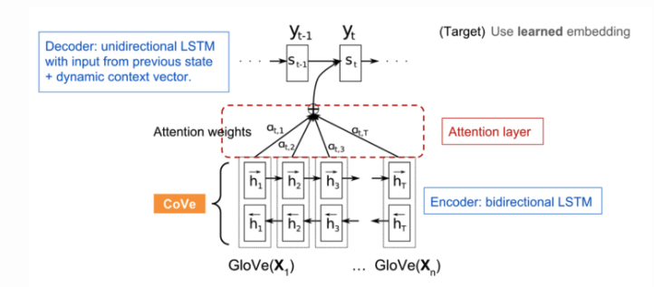
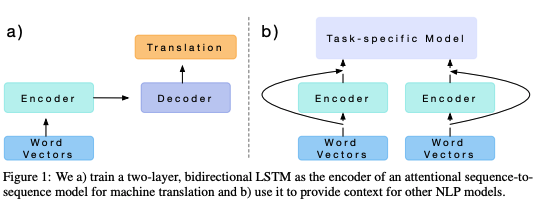
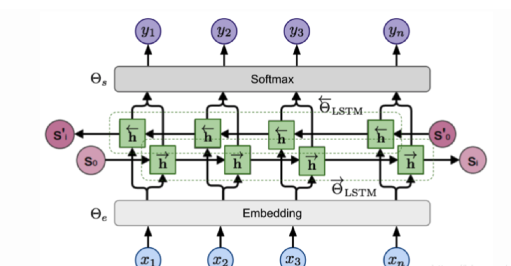

###  Contextual语言模型总结

- CoVe
- ELMo
- Cross-View训练
- ULMFiT
- GPT
- BERT

### 1.CoVe

[Learned in Translation: Contextualized Word Vectors （McCann et al. 2017）](https://arxiv.org/abs/1708.00107)

CoVe(Contextual Word Vectors)是一种由机器翻译领域中的Seq2SeqAttention模型中的Encoder学习得到的Word Embedding,和传统的Word Embedding不同，CoVe词向量表示的是整个句子的输入。

预训练的核心思想是借助深度学习模型复杂的结构和强大的非线性表示学习能力，学习到海量数据种存在的本质（知识），把这些知识以向量或者参数的形式存储起来，并通过feature或者parameter sharing的形式迁移到其他想相关的领域中。

#### NMT(Nerual Machine Translation )

神经机器翻译( NMT )模型由标准的双层双向LSTM构成的encoder，和带Attention Module的双层单向LSTM构成的decoder组成。

#### 下游任务中使用CoVe

#### CoVe的不足

- 与预训练模型受限于翻译模型中可获取的双语数据集数据量的影响
- CoVe对最终模型的性能的贡献与受特定任务相关的模型结构的限制

### 2.ELMo

[Deep contextualized word representations （Peters, et al, 2018）](https://arxiv.org/abs/1802.05365)

Embedding from Languaga Model(ELMo)通过无监督预训练多层双向LSTM模型来学习上下文信息（Contextual）的词向量表示。

#### bi-LSTM双向语言模型

Bi-LSTM是ELMo的基础，模型的输入是由n个token构成的序列$(x_1,...,x_n)$,语言模型根据历史的预测序列$(x_1,...,x_{n-1})$下一个token的概率

- 在正向计算过程中，根据历史之前的序列$(x_1,...,x_{i-1})$预测第$i$个词条$x_i$的概率：
  $$
  p\left(x_{1}, \ldots, x_{n}\right)=\prod_{i=1}^{n} p\left(x_{i} \mid x_{1}, \ldots, x_{i-1}\right)
  $$

- 在反向计算过程中，根据历史之后的序列$(x_{i+1},...,x_n)$预测第$i$个词条$x_i$的概率：
  $$
  p\left(x_{1}, \ldots, x_{n}\right)=\prod_{i=1}^{n} p\left(x_{i} \mid x_{i+1}, \ldots, x_{n}\right)
  $$

- 两个方向上的预测过程都是由多层 LSTMs建模的，给定输入词条$x_i$得到隐藏状态为$h \rightarrow i$和$ \mathrm{h} \leftarrow \mathrm{i}, \ell$

- 模型的损失函数：
  $$
  \begin{aligned}
  \mathcal{L}=-\sum_{i=1}^{n}(& \log p\left(x_{i} \mid x_{1}, \ldots, x_{i-1} ; \Theta_{e}, \vec{\Theta}_{\mathrm{LSTM}}, \Theta_{s}\right)+\\
  &\left.\log p\left(x_{i} \mid x_{i+1}, \ldots, x_{n} ; \Theta_{e}, \overleftarrow{\Theta}_{\mathrm{LSTM}}, \Theta_{s}\right)\right)
  \end{aligned}
  $$

#### ELMo表示

在L层biLM之上，ELMO通过学习task-specific线性组合，将所有隐状态堆在一起。词条xi的隐状态表示包含2L+1向量：
$$
v_{i}=f\left(R_{i} ; \Theta^{\mathrm{task}}\right)=\gamma^{\mathrm{task}} \sum_{\ell=0}^{L} s_{i}^{\mathrm{task}} \mathbf{h}_{i, \ell}
$$

### 参考：

[详解BiLSTM及代码实现](https://zhuanlan.zhihu.com/p/47802053)

