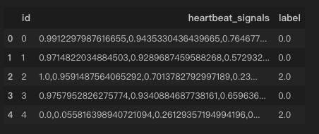

# Datawhale 零基础入门数据挖掘-Task1 赛题理解

## Task1赛题理解

Tip:本次新人赛是Datawhale与天池联合发起的零基础入门系列赛事第五场 —— 零基础入门心电图心跳信号多分类预测挑战赛。

2016年6月，国务院办公厅印发《国务院办公厅关于促进和规范健康医疗大数据应用发展的指导意见》,文件指出健康医疗大数据应用发展将带来健康医疗模式的深刻变化，有利于提升健康医疗服务效率和质量。

赛题以心电图数据为背景，要求选手根据心电图感应数据预测心跳信号，其中心跳信号对应正常病例以及受不同心律不齐和心肌梗塞影响的病例，这是一个多分类的问题。通过这道赛题来引导大家了解医疗大数据的应用，帮助竞赛新人进行自我练习、自我提高。

比赛地址：https://tianchi.aliyun.com/competition/entrance/531883/introduction

### 1.1学习目标

- [x] 理解赛题数据和目标，清楚评分体系。

- [x] 完成赛题报名和数据下载，理解赛题的解题思路。

- [x] 学习baseline方案，并成功运行提交结果。

### 1.2了解赛题

- 赛题概况
- 数据概况
- 预测指标
- 分析赛题

#### 1.2.1赛题概况

比赛要求参赛选手根据给定的数据集，建立模型，预测不同的心跳信号。赛题以预测心电图心跳信号类别为任务，数据集报名后可见并可下载，该该数据来自某平台心电图数据记录，总数据量超过20万，主要为1列心跳信号序列数据，其中每个样本的信号序列采样频次一致，长度相等。为了保证比赛的公平性，将会从中抽取10万条作为训练集，2万条作为测试集A，2万条作为测试集B，同时会对心跳信号类别（label）信息进行脱敏。

通过这道赛题来引导大家走进医疗大数据的世界，主要针对于于竞赛新人进行自我练习，自我提高。

#### 1.2.2数据概况

一般而言，对于数据在比赛界面都有对应的数据概况介绍（匿名特征除外），说明列的性质特征。了解列的性质会有助于我们对于数据的理解和后续分析。

 Tip:匿名特征，就是未告知数据列所属的性质的特征列。

train.csv

- id 为心跳信号分配的唯一标识
- heartbeat_signals 心跳信号序列(数据之间采用“,”进行分隔)
- label 心跳信号类别（0、1、2、3）

testA.csv

- id 心跳信号分配的唯一标识
- heartbeat_signals 心跳信号序列(数据之间采用“,”进行分隔)

#### 1.2.3预测指标

选手需提交4种不同心跳信号预测的概率，选手提交结果与实际心跳类型结果进行对比，求预测的概率与真实值差值的绝对值。

具体计算公式如下：

总共有n个病例，针对某一个信号，若真实值为[y1,y2,y3,y4],模型预测概率值为[a1,a2,a3,a4],那么该模型的评价指标abs-sum为
$$
{abs-sum={\mathop{ \sum }\limits_{{j=1}}^{{n}}{{\mathop{ \sum }\limits_{{i=1}}^{{4}}{{ \left| {y\mathop{{}}\nolimits_{{i}}-a\mathop{{}}\nolimits_{{i}}} \right| }}}}}}
$$
例如，某心跳信号类别为1，通过编码转成[0,1,0,0]，预测不同心跳信号概率为[0.1,0.7,0.1,0.1]，那么这个信号预测结果的abs-sum为
$$
{abs-sum={ \left| {0.1-0} \right| }+{ \left| {0.7-1} \right| }+{ \left| {0.1-0} \right| }+{ \left| {0.1-0} \right| }=0.6}
$$


多分类算法常见的评估指标如下：

其实多分类的评价指标的计算方式与二分类完全一样，只不过我们计算的是针对于每一类来说的召回率、精确度、准确率和 F1分数。

1、混淆矩阵（Confuse Matrix）

- （1）若一个实例是正类，并且被预测为正类，即为真正类TP(True Positive )
- （2）若一个实例是正类，但是被预测为负类，即为假负类FN(False Negative )
- （3）若一个实例是负类，但是被预测为正类，即为假正类FP(False Positive )
- （4）若一个实例是负类，并且被预测为负类，即为真负类TN(True Negative ）

第一个字母T/F，表示预测的正确与否；第二个字母P/N，表示预测的结果为正例或者负例。如TP就表示预测对了，预测的结果是正例，那它的意思就是把正例预测为了正例。

2.准确率（Accuracy）
准确率是常用的一个评价指标，但是不适合样本不均衡的情况，医疗数据大部分都是样本不均衡数据。
$$
Accuracy=\frac{Correct}{Total}\\
Accuracy = \frac{TP + TN}{TP + TN + FP + FN}
$$
3、精确率（Precision）也叫查准率简写为P

**精确率(Precision)**是针对预测结果而言的，其含义是**在被所有预测为正的样本中实际为正样本的概率**在被所有预测为正的样本中实际为正样本的概率，精确率和准确率看上去有些类似，但是是两个完全不同的概念。精确率代表对正样本结果中的预测准确程度，准确率则代表整体的预测准确程度，包括正样本和负样本。
$$
Precision = \frac{TP}{TP + FP}
$$
4.召回率（Recall） 也叫查全率 简写为R

**召回率(Recall)**是针对原样本而言的，其含义是**在实际为正的样本中被预测为正样本的概率**。
$$
Recall = \frac{TP}{TP + FN}
$$

下面我们通过一个简单例子来看看精确率和召回率。假设一共有10篇文章，里面4篇是你要找的。根据你的算法模型，你找到了5篇，但实际上在这5篇之中，只有3篇是你真正要找的。

那么算法的精确率是3/5=60%，也就是你找的这5篇，有3篇是真正对的。算法的召回率是3/4=75%，也就是需要找的4篇文章，你找到了其中三篇。以精确率还是以召回率作为评价指标，需要根据具体问题而定。

5.宏查准率（macro-P）

计算每个样本的精确率然后求平均值
$$
{macroP=\frac{{1}}{{n}}{\mathop{ \sum }\limits_{{1}}^{{n}}{p\mathop{{}}\nolimits_{{i}}}}}
$$
6.宏查全率（macro-R）

计算每个样本的召回率然后求平均值
$$
{macroR=\frac{{1}}{{n}}{\mathop{ \sum }\limits_{{1}}^{{n}}{R\mathop{{}}\nolimits_{{i}}}}}
$$
7.宏F1（macro-F1）
$$
{macroF1=\frac{{2 \times macroP \times macroR}}{{macroP+macroR}}}
$$
与上面的宏不同，微查准查全，先将多个混淆矩阵的TP,FP,TN,FN对应位置求平均，然后按照P和R的公式求得micro-P和micro-R，最后根据micro-P和micro-R求得micro-F1

8.微查准率（micro-P）
$$
{microP=\frac{{\overline{TP}}}{{\overline{TP} \times \overline{FP}}}}
$$
9.微查全率（micro-R）
$$
{microR=\frac{{\overline{TP}}}{{\overline{TP} \times \overline{FN}}}}
$$
10.微F1（micro-F1）
$$
{microF1=\frac{{2 \times microP\times microR }}{{microP+microR}}}
$$

#### 1.2.4参赛规则

- 报名成功后，选手下载数据，在本地调试算法，每天可提交3次结果；

-  提交后将进行实时评测；每天排行榜更新时间为12:00和20:00，按照评测指标得分从高到低排序；排行榜将选择历史最优成绩进行展示；

#### 1.2.5赛题分析

- 本题为传统的数据挖掘问题，通过数据科学以及机器学习深度学习的办法来进行建模得到结果。
- 本题为典型的多分类问题，心跳信号一共有4个不同的类别
- 主要应用xgb、lgb、catboost，以及pandas、numpy、matplotlib、seabon、sklearn、keras等等数据挖掘常用库或者框架来进行数据挖掘任务。

### 1.3代码示例

本部分为对于数据读取和指标评价的示例。

#### 1.3.1数据读取pandas

```python
import pandas as pd
import numpy as np


path='./data/'
train_data=pd.read_csv(path+'train.csv')
test_data=pd.read_csv(path+'testA.csv')
print('Train data shape:',train_data.shape)
print('TestA data shape:',test_data.shape)
```

```python
train_data.head()
```



```python
test_data.head()
```


#### 1.3.2分类指标计算示例

这里演示一下多分类评估指标的计算

```python
from sklearn.metrics import accuracy_score, precision_score, recall_score
from sklearn.metrics import f1_score
y_true    = [1, 1, 1, 1, 1, 2, 2, 2, 2, 3, 3, 3, 4, 4,5,5,6,6,6,0,0,0,0] #真实值
y_pred = [1, 1, 1, 3, 3, 2, 2, 3, 3, 3, 4, 3, 4, 3,5,1,3,6,6,1,1,0,6] #预测值

#计算准确率
print("accuracy:", accuracy_score(y_true, y_pred))
#计算精确率
#计算macro_precision
print("macro_precision", precision_score(y_true, y_pred, average='macro'))
#计算micro_precision
print("micro_precision", precision_score(y_true, y_pred, average='micro'))
#计算召回率
#计算macro_recall
print("macro_recall", recall_score(y_true, y_pred, average='macro'))
#计算micro_recall
print("micro_recall", recall_score(y_true, y_pred, average='micro'))
#计算F1
#计算macro_f1
print("macro_f1", f1_score(y_true, y_pred, average='macro'))
#计算micro_f1
print("micro_f1", f1_score(y_true, y_pred, average='micro'))
```

```
accuracy: 0.5217391304347826
macro_precision 0.7023809523809524
micro_precision 0.5217391304347826
macro_recall 0.5261904761904762
micro_recall 0.5217391304347826
macro_f1 0.5441558441558441
micro_f1 0.5217391304347826
```

```python
def abs_sum(y_pre,y_tru):
    #y_pre为预测概率矩阵
    #y_tru为真实类别矩阵
    y_pre=np.array(y_pre)
    y_tru=np.array(y_tru)
    loss=sum(sum(abs(y_pre-y_tru)))
    return loss
```

```python
y_pre=[[0.1,0.1,0.7,0.1],[0.1,0.1,0.7,0.1]]
y_tru=[[0,0,1,0],[0,0,1,0]]
print(abs_sum(y_pre,y_tru))
```

```
1.2
```

Baseline 使用Lgb进行分类任务

```python
def cv_model(clf, train_x, train_y, test_x, clf_name):
    folds = 5
    seed = 2021
    kf = KFold(n_splits=folds, shuffle=True, random_state=seed)
    test = np.zeros((test_x.shape[0], 4))

    cv_scores = []
    onehot_encoder = OneHotEncoder(sparse=False)
    for i, (train_index, valid_index) in enumerate(kf.split(train_x, train_y)):
        print(
            '************************************ {} ************************************'
            .format(str(i + 1)))
        trn_x, trn_y, val_x, val_y = train_x.iloc[train_index], train_y[
            train_index], train_x.iloc[valid_index], train_y[valid_index]

        if clf_name == "lgb":
            train_matrix = clf.Dataset(trn_x, label=trn_y)
            valid_matrix = clf.Dataset(val_x, label=val_y)

            params = {
                'boosting_type': 'gbdt',
                'objective': 'multiclass',
                'num_class': 4,
                'num_leaves': 2**5,
                'feature_fraction': 0.8,
                'bagging_fraction': 0.8,
                'bagging_freq': 4,
                'learning_rate': 0.1,
                'seed': seed,
                'nthread': 28,
                'n_jobs': 24,
                'verbose': -1,
            }

            model = clf.train(params,
                              train_set=train_matrix,
                              valid_sets=valid_matrix,
                              num_boost_round=2000,
                              verbose_eval=100,
                              early_stopping_rounds=200)
            val_pred = model.predict(val_x, num_iteration=model.best_iteration)
            test_pred = model.predict(test_x,
                                      num_iteration=model.best_iteration)

        val_y = np.array(val_y).reshape(-1, 1)
        val_y = onehot_encoder.fit_transform(val_y)
        print('预测的概率矩阵为：')
        print(test_pred)
        test += test_pred
        score = abs_sum(val_y, val_pred)
        cv_scores.append(score)
        print(cv_scores)
    print("%s_scotrainre_list:" % clf_name, cv_scores)
    print("%s_score_mean:" % clf_name, np.mean(cv_scores))
    print("%s_score_std:" % clf_name, np.std(cv_scores))
    test = test / kf.n_splits

    return test
```

```python
def lgb_model(x_train, y_train, x_test):
    lgb_test = cv_model(lgb, x_train, y_train, x_test, "lgb")
    return lgb_test

lgb_test = lgb_model(x_train, y_train, x_test)
```


### 1.4经验总结

赛题理解的是数据竞赛的第一步，也是极其重要的一步，赛题的理解会影响后续的特征工程以及构建模型的思路。赛题背后的思想以及赛题的业务逻辑的理解也能很大程度的增加强特征的构建，从而构建更有效的模型。

- 在开始比赛之前要对赛题进行充分的了解

  读懂赛题的背景，赛题数据的来源，赛题数据的概况，对于赛题数据有一个初步了解，知道现在和任务的相关数据有哪些，其中数据之间的关联逻辑是什么样的。

- 了解比赛的时间与比赛的规则

  仔细阅读赛题说明，包括比赛的开始时间、结束时间，B榜开放时间，以及数据提交的规则，特别是有些比赛对提交的数据有详细的要求，不符合要求的数据会严重影响得分情况，同时也能根据数据提交的规则判断自己预测的数据是否合理。

- 关注相关比赛以及其它选手的分享

  比赛开始后，可以关注与比赛相关的文章，加入赛题官方群与其它选手讨论以及研究其它选手的思路，仔细研究其它选手分享的思路就相当于你和其它选手进行赛题讨论，这样的讨论往往能打开你的思路，从而理解赛题的要点

- 保留不同模型的代码和结果

  对于每一次构建模型的代码和运行出来的结果最好能进行保存，有的比赛需要选手提供原始模型构建代码，这个时候重头再写整个代码会比较浪费时间。不同模型预测出来的结果进行适当的融合有时候也会提分很多，成为一个提分的利器

