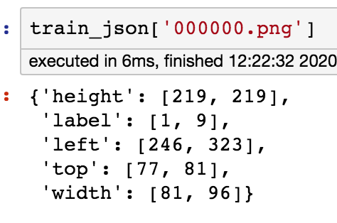
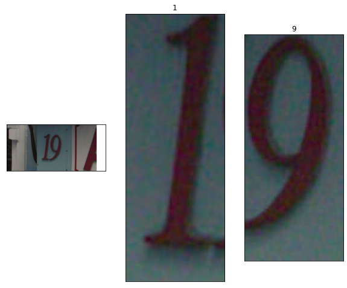
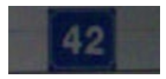
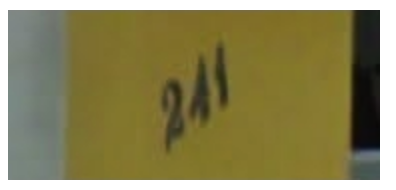
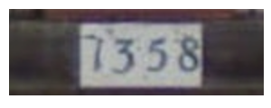
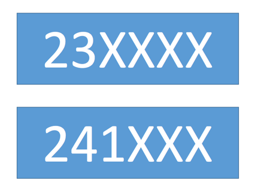
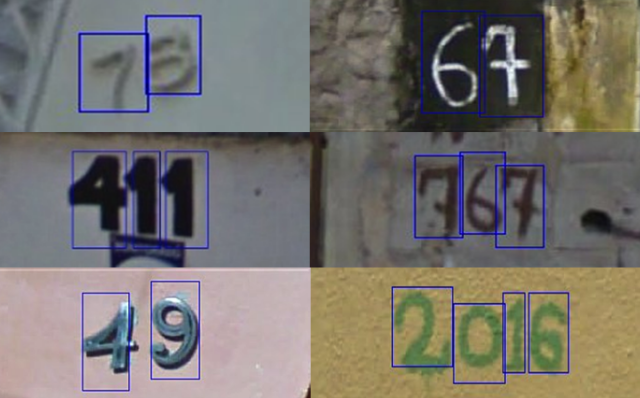

# 赛题理解

- 赛题名称：零基础入门CV之街道字符识别             
- 赛题目标：通过这道赛题可以引导大家走入计算机视觉的世界，主要针对竞赛选手上手视觉赛题，提高对数据建模能力。       
- 赛题任务：赛题以计算机视觉中字符识别为背景，要求选手预测街道字符编码，这是一个典型的字符识别问题。      
  为了简化赛题难度，赛题数据采用公开数据集[SVHN](http://ufldl.stanford.edu/housenumbers/)，因此大家可以选择很多相应的paper作为思路参考。      

## 1.1街道字符识别

## 1.2赛题数据

数据集样本展示：


训练集数据包括3W张照片，验证集数据包括1W张照片，测试集A包括4W张照片

## 1.3数据标签说明

对于训练数据每张图片将给出对于的编码标签，和具体的字符框的位置（训练集、测试集和验证集都给出字符位置），可用于模型训练：

| Field  | Description |      |
| ------ | ----------- | ---- |
| top    | 左上角坐标X |      |
| height | 字符高度    |      |
| left   | 左上角最表Y |      |
| width  | 字符宽度    |      |
| label  | 字符编码    |      |

字符的坐标具体如下所示：     
     
     
 在比赛数据（训练集、测试集和验证集）中，同一张图片中可能包括一个或者多个字符，因此在比赛数据的JSON标注中，会有两个字符的边框信息：   

   



## 1.4评价指标

$$
 Score=编码识别正确的数量/测试集图片数量    
$$

## 1.5数据读取

Json中标签的读取方式

```python 
train_json = json.load(open('/content/drive/My Drive/Colab/街景字符识别/data/train.json'))

# 数据标注处理
def parse_json(d):
    arr = np.array([
        d['top'], d['height'], d['left'],  d['width'], d['label']
    ])
    arr = arr.astype(int)
    return arr

img = cv2.imread('/content/drive/My Drive/Colab/街景字符识别/data/train/000000.png')
arr = parse_json(train_json['000000.png'])

plt.figure(figsize=(10, 10))
plt.subplot(1, arr.shape[1]+1, 1)
plt.imshow(img)
plt.xticks([]); plt.yticks([])

for idx in range(arr.shape[1]):
    plt.subplot(1, arr.shape[1]+1, idx+2)
    plt.imshow(img[arr[0, idx]:arr[0, idx]+arr[1, idx],arr[2, idx]:arr[2, idx]+arr[3, idx]])
    plt.title(arr[4, idx])
    plt.xticks([]); plt.yticks([])  
```



## 1.6解题思路

赛题本质是分类问题，需要对图片的字符进行识别

### 难点：赛题给定的数据图片中不同图片中包含的字符数量不同，2,3,4...

| 字符属性                 | 图片                                    |
| ------------------------ | --------------------------------------- |
| 字符：42   字符个数：2   |      |
| 字符：241   字符个数：3  |  |
| 字符：7358   字符个数：4 |  |

### 解决方法：

- 定长字符识别

  可以将赛题抽象为一个定长字符识别问题，在赛题数据集中大部分图像中字符个数为2-4个，最多的字符个数为6个。                 
  因此可以对于所有的图像都抽象为6个字符的识别问题，字符23填充为23XXXX，字符231填充为231XXX。      

  

  经过填充之后，原始的赛题可以简化了6个字符的分类问题。在每个字符的分类中会进行11个类别的分类，假如分类为填充字符，则表明该字符为空。    

- 不定长字符识别

  在字符识别研究中，有特定的方法来解决此种不定长的字符识别问题，比较典型的有CRNN字符识别模型。 
  在本次赛题中给定的图像数据都比较规整，可以视为一个单词或者一个句子。   

- 检测再识别

  在赛题数据中已经给出了训练集、验证集中所有图片中字符的位置，因此可以首先将字符的位置进行识别，利用物体检测的思路完成。    

  

  此种思路需要参赛选手构建字符检测模型，对测试集中的字符进行识别。选手可以参考物体检测模型SSD或者YOLO来完成。

