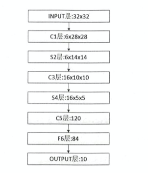
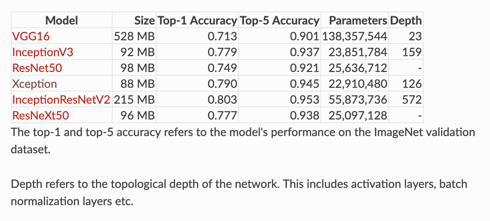
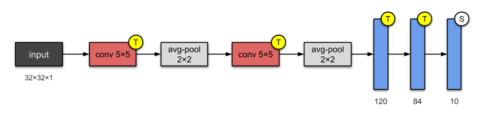
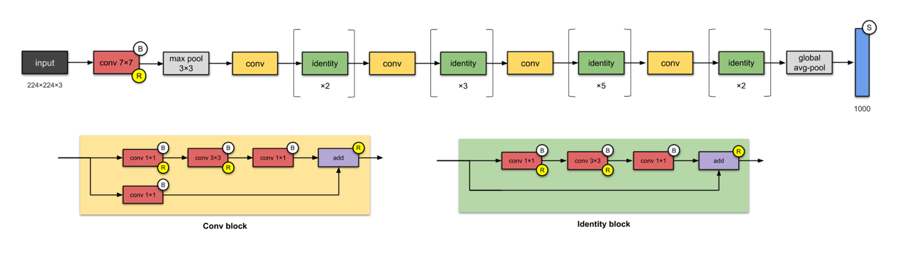

<!-- START doctoc generated TOC please keep comment here to allow auto update -->
<!-- DON'T EDIT THIS SECTION, INSTEAD RE-RUN doctoc TO UPDATE -->
**Table of Contents**  *generated with [DocToc](https://github.com/thlorenz/doctoc)*

- [3.1 学习目标](#31-%E5%AD%A6%E4%B9%A0%E7%9B%AE%E6%A0%87)
- [3.2 CNN介绍](#32-cnn%E4%BB%8B%E7%BB%8D)
    - [3.2.1 卷积层](#321-%E5%8D%B7%E7%A7%AF%E5%B1%82)
    - [3.2.2池化层](#322%E6%B1%A0%E5%8C%96%E5%B1%82)
    - [3.2.3 全连接层](#323-%E5%85%A8%E8%BF%9E%E6%8E%A5%E5%B1%82)
- [3.3CNN发展](#33cnn%E5%8F%91%E5%B1%95)
- [4.Pytorch构建CNN模型](#4pytorch%E6%9E%84%E5%BB%BAcnn%E6%A8%A1%E5%9E%8B)

<!-- END doctoc generated TOC please keep comment here to allow auto update -->

## 3.1 学习目标

1. 学习CNN基础和原理
2. 使用pytorch框架构建一个CNN模型并完成训练

## 3.2 CNN介绍

积神经网络（简称CNN）是一类特殊的人工神经网络，是深度学习中重要的一个分支。CNN在很多领域都表现优异，精度和速度比传统计算学习算法高很多。特别是在计算机视觉领域，CNN是解决图像分类、图像检索、物体检测和语义分割的主流模型。      

CNN每一层由众多的卷积核组成，每个卷积核对输入的像素进行卷积操作，得到下一次的输入。随着网络层的增加卷积核会逐渐扩大感受野，并缩减图像的尺寸。

CNN是一种层次模型，输入的是原始的像素数据。CNN通过卷积（convolution）、池化（pooling）、非线性激活函数（non-linear activation function）和全连接层（fully connected layer）构成。

通过多次卷积和池化，CNN的最后一层将输入的图像像素映射为具体的输出。如在分类任务中会转换为不同类别的概率输出，然后计算真实标签与CNN模型的预测结果的差异，并通过反向传播更新每层的参数，并在更新完成后再次前向传播，如此反复直到训练完成 。

与传统机器学习模型相比，CNN具有一种端到端（End to End）的思路。在CNN训练的过程中是直接从图像像素到最终的输出，并不涉及到具体的特征提取和构建模型的过程，也不需要人工的参与。

#### 3.2.1 卷积层

卷积层的主要作用是是对输入的数据进行特征提取，完成该功能的是卷积层中的卷积核（Filter）,可以把卷积核看做一个指定窗口大小的扫描器，扫描器通一次又一次地扫描输入的数据。

常用的卷积h核大小为$3*3$和$5*5$

定义卷积核的深度时，只需要保持和输入图像的的色彩通道数一致即可

卷积通用公式：

$$W_{\text {output }}=\frac{W_{\text {input }}-W_{\text {filler }}+2 P}{S}+1$$ 

$$H_{\text {output }}=\frac{H_{\text {input }}-H_{\text {filter }}+2 P}{S}+1$$

P(Padding)表示在图像边缘增加的边界像素层数

#### 3.2.2池化层

卷积神经网络中的池化层可以看做是卷积神经网络中的一种提取输入数据的核心特征的方式，不仅实现了对原始数据的压缩，还大量减少了参与模型计算的参数，提升了计算效率。

池化层本身没有参数

池化通用公式：

$W_{\text {output }}=\frac{W_{\text {input }}-W_{\text {filter }}}{S}+1$ $H_{\text {output }}=\frac{H_{\text {input }}-H_{\text {filler }}}{S}+1$

S表示滑动窗口的步长

#### 3.2.3 全连接层

全连接层的主要作用是将输入图像在经过卷积核池化操作后提取的特征进行压缩，并且根据压缩的特征完成模型的分类功能。

## 3.3CNN发展

比较典型的CNN结构是Alexnet、VGG、InceptionV3、ResNet等

1. #### LeNet-5(1998)

   

2. #### AlexNet(2012)

   

3. #### VGG-16(2014)

   相比较AlexNet而言，VGGnet模型中统一了卷积中使用的参数（卷积核滑动窗口中的高度和宽度统一为$3\times3$,卷积核步长统一为1，Padding统一为1），而且增加了卷积神经网络模型架构的深度，分别定义了16层的VGG16模型和19层的VGG19模型。

   

4. #### GooleNet(2014)

   GooleNet模型的深度达到了22层，而且网络结构中引入了Inception单元，

   

5. #### ResNet-50(2015)

   ResNet是更深的卷积网络模型，模型中引入了一种残差网络（Residual Network）结构，通过使用残差网路结构，深层次的卷积神经网络不仅避免了出现模型性能退化的问题，反而取得了更好的性能。

残差模块中的恒等映射（Identity mapping）不会给整个Resnet增加额外的参数和计算量，却能增加模型的训练速度，提升模型的训练效果。

在此之前的残差模块上引入NIN单元，使用$1\times1$的卷积层来减少模型训练的参数量，同时可以减少整个模型的计算量，使得可以拓展更深的模型结构。

## 4.Pytorch构建CNN模型

