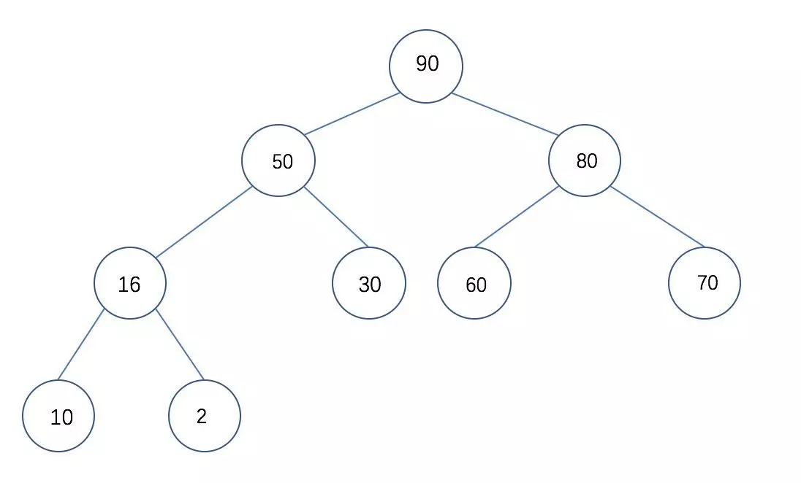
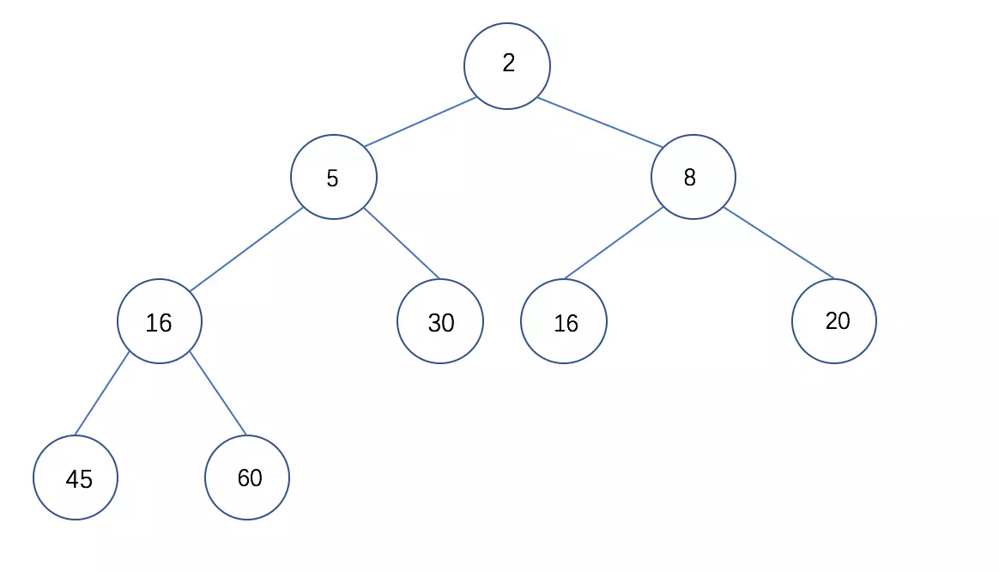

<!-- START doctoc generated TOC please keep comment here to allow auto update -->
<!-- DON'T EDIT THIS SECTION, INSTEAD RE-RUN doctoc TO UPDATE -->
**Table of Contents**  *generated with [DocToc](https://github.com/thlorenz/doctoc)*

- [Python经典排序算法](#python%E7%BB%8F%E5%85%B8%E6%8E%92%E5%BA%8F%E7%AE%97%E6%B3%95)
  - [1.冒泡排序](#1%E5%86%92%E6%B3%A1%E6%8E%92%E5%BA%8F)
  - [2.选择排序](#2%E9%80%89%E6%8B%A9%E6%8E%92%E5%BA%8F)
  - [3.插入排序](#3%E6%8F%92%E5%85%A5%E6%8E%92%E5%BA%8F)
  - [4.希尔排序](#4%E5%B8%8C%E5%B0%94%E6%8E%92%E5%BA%8F)
  - [5.归并排序](#5%E5%BD%92%E5%B9%B6%E6%8E%92%E5%BA%8F)
  - [6.快速排序](#6%E5%BF%AB%E9%80%9F%E6%8E%92%E5%BA%8F)
    - [算法描述](#%E7%AE%97%E6%B3%95%E6%8F%8F%E8%BF%B0)
    - [code](#code)
    - [算法改进](#%E7%AE%97%E6%B3%95%E6%94%B9%E8%BF%9B)
  - [7.堆排序](#7%E5%A0%86%E6%8E%92%E5%BA%8F)
  - [8.基数排序](#8%E5%9F%BA%E6%95%B0%E6%8E%92%E5%BA%8F)
  - [9.桶排序](#9%E6%A1%B6%E6%8E%92%E5%BA%8F)
  - [参考](#%E5%8F%82%E8%80%83)

<!-- END doctoc generated TOC please keep comment here to allow auto update -->

# Python经典排序算法

排序算法可以分为内部排序和外部排序，内部排序是数据记录在内存中进行排序，而外部排序是因排序的数据很大，一次不能容纳全部的排序记录，在排序过程中需要访问外存。常见的内部排序算法有：插入排序、希尔排序、选择排序、冒泡排序、归并排序、快速排序、堆排序、基数排序等。用一张图概括：


**时间复杂度**

| 时间复杂度                                   | 排序算法                       |
| :------------------------------------------- | ------------------------------ |
| $O(n^2)$                                     | 直接插入、直接选择和冒泡排序。 |
| $O(nlog_2n)$                                 | 快速排序、堆排序和归并排序     |
| $O(n(1+§))$ 排序，§ 是介于 0 和 1 之间的常数 | 希尔排序                       |
| $O(n)$                                       | 基数排序、桶排序、箱排序       |

**稳定性**

稳定性：排序后 2 个相等键值的顺序和排序之前它们的顺序相同

**稳定**的排序算法：冒泡排序、插入排序、归并排序和基数排序。

**不稳定**的排序算法：选择排序、快速排序、希尔排序、堆排序。

名词解释：

- n：数据规模

- k：“桶”的个数

- In-place：占用常数内存，不占用额外内存

- Out-place：占用额外内存


 

## 1.冒泡排序


冒泡排序（Bubble Sort）也是一种简单直观的排序算法。它重复地走访过要排序的数列，一次比较两个元素，如果他们的顺序错误就把他们交换过来。走访数列的工作是重复地进行直到没有再需要交换，也就是说该数列已经排序完成。这个算法的名字由来是因为越小的元素会经由交换慢慢“浮”到数列的顶端。

- 算法描述
  1. 比较相邻的元素。如果第一个比第二个大，就交换他们两个。
  2. 对每一对相邻元素作同样的工作，从开始第一对到结尾的最后一对。这步做完后，最后的元素会是最大的数。
  3. 针对所有的元素重复以上的步骤，除了最后一个。
  4. 持续每次对越来越少的元素重复上面的步骤，直到没有任何一对数字需要比较。
- 动图演示


- code in python

  ```python
      def bubble_sort(self, arry):
          """冒泡排序"""
          n = len(arry)
          # 遍历所有数组元素
          for i in range(n):
  
              for j in range(n - i - 1):
                  # 如果前者比或后者大，交换两者
                  if arry[j - 1] > arry[j]:
                      arry[j - 1], arry[j] = arry[j], arry[j - 1]
  
          return arry
  ```

- 算法优化

  ``` python
      def bubble_sort_opt(self, arry):
          """冒泡排序优化"""
          n = len(arry)
          for i in range(n):
          # 有序标记，每一轮开始都是true ,用于判断元素间是否进行交换
            isSorted = True
            for j in range(n - j - 1):
                if arry[j] > arry[j + 1]:
                    arry[j], arry[j + 1] = arry[j + 1], arry[j]
                    # 有交换行为设置为FALSE
                    isSorted = False
            # 无交换行为（isSorted=true）直接跳出本次循环
            if isSorted:
                break
          return arry 
  ```

  
## 2.选择排序

选择排序是一种简单直观的排序算法，无论什么数据进去都是 O(n²) 的时间复杂度。所以用到它的时候，数据规模越小越好。

- 算法描述

  1. 首先在未排序序列中找到最小（大）元素，存放到排序序列的起始位置
  2. 再从剩余未排序元素中继续寻找最小（大）元素，然后放到已排序序列的末尾。
  3. 重复第二步，直到所有元素均排序完毕。

- 动图演示

  

- code in python

  ```python
      def selectionSort(self, arry):
          n = len(arry)
  
          for i in range(n - 1):
              # 记录最小索引位置
              min = i
              for j in (i + 1, n):
                  if arry[j] < arry[min]:
                      min = j
              # i不是最小数时，将i和最小数进行交换
              if i != min:
                  arry[i], arry[min] = arry[min], arry[i]
  
      return arry
  ```

  

## 3.插入排序

插入排序的工作原理是通过构建有序序列，对于未排序数据，在已排序序列中从后向前扫描，找到相应位置并插入。

- 算法描述

  1. 第一待排序序列第一个元素看做一个有序序列，把第二个元素到最后一个元素当成是未排序序列。
  2. 从头到尾依次扫描未排序序列，将扫描到的每个元素插入有序序列的适当位置。（如果待插入的元素与有序序列中的某个元素相等，则将待插入元素插入到相等元素的后面。）

- 动图演示

  

- code in python

  ```python
      def insertion_sort(arr):
          """插入排序"""
          # 第一层for表示循环插入的遍数
          for i in range(1, len(arr)):
              # 设置当前需要插入的元素
              current = arr[i]
              # 与当前元素比较的比较元素
              pre_index = i - 1
              while pre_index >= 0 and arr[pre_index] > current:
                  # 当比较元素大于当前元素则把比较元素后移
                  arr[pre_index + 1] = arr[pre_index]
                  # 往前选择下一个比较元素
                  pre_index -= 1
            # 当比较元素小于当前元素，则将当前元素插入在其后面
              arr[pre_index + 1] = current
          return arr
  ```
  
  

## 4.希尔排序

希尔排序，也称递减增量排序算法，是插入排序的一种更高效的改进版本。但希尔排序是非稳定排序算法。

希尔排序的基本思想是：先将整个待排序的记录序列分割成为若干子序列分别进行直接插入排序，待整个序列中的记录“基本有序”时，再对全体记录进行依次直接插入排序。

- 算法描述

  1. 择一个增量序列 t1，t2，……，tk，其中 ti > tj, tk = 1；
  2. 按增量序列个数 k，对序列进行 k 趟排序；
  3. 每趟排序，根据对应的增量 ti，将待排序列分割成若干长度为 m 的子序列，分别对各子表进行直接插入排序。仅增量因子为 1 时，整个序列作为一个表来处理，表长度即为整个序列的长度。

  - 例题  

    例如，假设有这样一组数[ 13 14 94 33 82 25 59 94 65 23 45 27 73 25 39 10 ]，如果我们以步长为5开始进行排序，我们可以通过将这列表放在有5列的表中来更好地描述算法，这样他们就应该看起来是这样(竖着的元素是步长组成)：

    13 14 94 33 82

    

    25 59 94 65 23

    

    45 27 73 25 39

    

    10

    

    然后我们对每列进行排序：

    

    10 14 73 25 23

    

    13 27 94 33 39

    

    25 59 94 65 82

    

    45
    将上述四行数字，依序接在一起时我们得到：[ 10 14 73 25 23 13 27 94 33 39 25 59 94 65 82 45 ]。这时10已经移至正确位置了，然后再以3为步长进行排序：

    

    10 14 73

    

    25 23 13

    

    27 94 33

    

    39 25 59

    

    94 65 82

    

    45

    

    排序之后变为：

    

    10 14 13

    

    25 23 33

    

    27 25 59

    

    39 65 73

    

    45 94 82

    

    94

    

    最后以1步长进行排序（此时就是简单的插入排序了）

- 动图演示

  

- code  in  python 


## 5.归并排序

归并排序（Merge sort）是建立在归并操作上的一种有效的排序算法。该算法是采用分治法（Divide and Conquer）的一个非常典型的应用。

作为一种典型的分而治之思想的算法应用，归并排序的实现由两种方法：

- 自上而下的递归（所有递归的方法都可以用迭代重写，所以就有了第 2 种方法）；

- 自下而上的迭代；

  

和选择排序一样，归并排序的性能不受输入数据的影响，但表现比选择排序好的多，因为始终都是 O(nlogn) 的时间复杂度。代价是需要额外的内存空间。


#### 算法描述

1. 申请空间，使其大小为两个已经排序序列之和，该空间用来存放合并后的序列；
2. 设定两个指针，最初位置分别为两个已经排序序列的起始位置；
3. 比较两个指针所指向的元素，选择相对小的元素放入到合并空间，并移动指针到下一位置；
4. 重复步骤 3 直到某一指针达到序列尾；
5. 将另一序列剩下的所有元素直接复制到合并序列尾。

#### 动图演示


#### Code in Python  

```python
    def merge(self, left, right):
        result = []
        while left and right:
            if left[0] <= right[0]:
                result.append(left.pop(0))
            else:
                result.append(right.pop(0))

        while left:
            result.append(left.pop(0))
        while right:
            result.append(right.pop(0))

        return result

    def mergeSort(self, arry):
        n = len(arry)
        if n < 2:
            return arry
        mid = n // 2
        left, right = arry[0: mid], arry[mid+1:]

        return merge(mergeSort(left), mergeSort(right))
```


## 6.快速排序

快速排序是由东尼·霍尔所发展的一种排序算法。在平均状况下，排序 n 个项目要 Ο(nlogn) 次比较。在最坏状况下则需要 $Ο(n^2)$ 次比较，但这种状况并不常见。事实上，快速排序通常明显比其他 $Ο(nlogn)$ 算法更快，因为它的内部循环（inner loop）可以在大部分的架构上很有效率地被实现出来。

快速排序使用分治法（Divide and conquer）策略来把一个串行（list）分为两个子串行（sub-lists）。

快速排序又是一种分而治之思想在排序算法上的典型应用。本质上来看，快速排序应该算是在冒泡排序基础上的递归分治法。

快速排序的最坏运行情况是 $O(n²)$，比如说顺序数列的快排。但它的平摊期望时间是 O(nlogn)，且 O(nlogn) 记号中隐含的常数因子很小，比复杂度稳定等于 O(nlogn) 的归并排序要小很多。所以，对绝大多数顺序性较弱的随机数列而言，快速排序总是优于归并排序。

### 算法描述

1. 从数列中挑出一个元素，称为 “基准”（pivot）;

2. 重新排序数列，所有元素比基准值小的摆放在基准前面，所有元素比基准值大的摆在基准的后面（相同的数可以到任一边）。在这个分区退出之后，该基准就处于数列的中间位置。这个称为分区（partition）操作；

3. 递归地（recursive）把小于基准值元素的子数列和大于基准值元素的子数列排序；

   动图演示

   

   

   ### code

   ```python 
   def quickSort(arry):
           '''
           快速排序
   
           Arguments:
                   arry {[type]} -- [description]
   
           Returns:
                   [type] -- [description]
           '''
           n = len(arry)
           if n < 2:
               return arry
           # 选取基准值，中间值便于理解
           pivot = arry[n // 2]
           # 定义基准值左右两个数列
           arry_left, arry_right = [], []
           # 删除原数列的基准值
           arry.remove(pivot)
   
           for item in arry:
               # 小于基准值放在左边
               if item <= pivot:
                   arry_left.append(item)
               # 大于基准值放在右边
               else:
                   arry_right.append(item)
           # 使用迭代进行比较
           return quickSort(arry_left) + [pivot] + quickSort(arry_right)
   ```
   
   ### 算法改进
   
   随机基准值


  

  ## 7.堆排序

  堆排序（Heapsort）是指利用堆这种数据结构所设计的一种排序算法。堆积是一个近似完全二叉树（一种除了最后一层之外的其他每一层都被完全填充，并且所有结点都保持向左对齐的树）的结构，并同时满足堆积的性质：即子结点的键值或索引总是小于（或者大于）它的父节点。堆排序可以说是一种利用堆的概念来排序的选择排序。分为两种方法：

  1. 大顶堆：每个节点的值都大于或等于其子节点的值，在堆排序算法中用于升序排列；
  
     
  
     
  
  2. 小顶堆：每个节点的值都小于或等于其子节点的值，在堆排序算法中用于降序排列；
  
     
  
     
     
     

  堆排序的平均时间复杂度为 Ο(nlogn)。

  - 算法描述
  
    - 首先将待排序的数组构造出一个大根堆
    - 取出这个大根堆的堆顶节点(最大值)，与堆的最下最右的元素进行交换，然后把剩下的元素再构造出一个大根堆
    - 重复第二步，直到这个大根堆的长度为1，此时完成排序。

  具体描述为：

  以由对数组从小到大进行排序的情况，需要构建大根堆。

  1.首先将整个数组进行构建一个大根堆得到[0,R1,....,Rn]（具体实现后面讲）

  2.由于R1是最大的数，所以把R1与Rn改变位置，变成[0,Rn,...,Rn-1,R1]，此时[0,Rn...,Rn-1]是无序的，[R1]是有序的

  3.对数组[0,Rn...,Rn-1]进行重构大根堆，得到[0,R2,....,Rn-1]

  4.由于R2是最大的数，所以把R2与Rn-1改变位置，变成[0,Rn-1,...Rn-2,R2,R1]，此时[0,Rn-1...,Rn-2]是无序的，[R2,R1]是有序的

  5.重复以上步骤，直到无序列表只有[0]，最终得到的有序序列则是按照从小到大规律排列的。

  - 动图演示

    

    

  - code in python

    **关于数组下标**

    将一个数组构建成二叉树的结构，那么对于其中某一个元素的index假设为n，满足以下条件：

    1）它的父节点若存在，父节点的index为n//2(n//2指n除以2取整数)

    2）若是左子节点存在，index为2*n

    3）若是右子节点存在，index为2*n+1

    注意：以上条件是在index是从1开始才满足，所以在后面计算中会在数组第一个位置添加一个[0]作为占位元素。

    ``` python
    from collections import deque
    L = deque([50, 16, 30, 10, 60,  90,  2, 80, 70])
    L.appendleft(0)
    ```

    


## 8.基数排序


  code in python 

```python
    def radixSort(lists, radix=10):
        """基数排序"""
        k = int(math.ceil(math.log(max(lists), radix)))
        bucket = [[] for i in range(radix)]
        for i in range(1, k + 1):
            for j in lists:
                bucket[j / (radix ** (i - 1)) % (radix * i)].append(j)
            del lists[:]
            for z in bucket:
                lists += z
                del z[:]

        return lists
```

## 9.桶排序

```python
def bucket_sort(nums):
    # 选择一个最大的数
    max_num = max(nums)
    #  创建一个元素全是0的列表，当做桶
    bucket = [0] * (max_num + 1)
    # 把所有元素放入桶中，把对应元素个数加一
    for i in nums:
        bucket[i] += 1
    #   存储排序好的元素
    sort_nums = []
    # 取出桶中的元素
    for j in range(len(bucket)):
        if bucket[j] != 0:
            for y in range(bucket[j]):
                sort_nums.append(j)

    return sort_nums
```

时间复杂度：O(N)

空间复杂度：O(N)

## 参考

[pyhton3教程](https://www.runoob.com/python3/python3-tutorial.html)

[十大经典排序算法](https://www.cnblogs.com/onepixel/articles/7674659.html)

[⼗⼤大排序算法](https://mp.weixin.qq.com/s/Qf416rfT4pwURpW3aDHuCg)

[堆排序的Python实现(附详细过程图和讲解)](https://www.jianshu.com/p/d174f1862601)


/Applications/Sublime Text.app/Contents/SharedSupport/bin/subl

